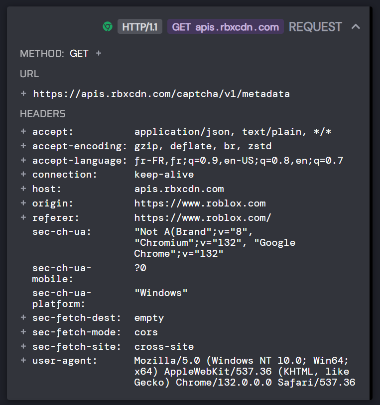

# Roblox Reverse Engineering Documentation

This is my first **REAL** reverse engineering project, and I decided to do it on Roblox. I tried to reverse as much as possible and document it as much as possible. __**IT'S NOT FINISHED**__, and yes... I haven't finished everything because I have to take care of the solver which seems super complicated!!!

# Documentation:

- 1 - [Requests](#1-requests)
- 2 - [CSRF Tokens](#2-csrf-tokens)
- 3 - [Payloads](#3-payloads)
- 4 - [Captcha](#4-captcha)

## 1. Requests

Here's how I intercepted requests from Roblox.

1. Install [HTTP Toolkit](https://httptoolkit.com/).
2. Install [Google Chrome](https://www.google.com/chrome/).
3. Launch HTTPTK, and start a Chrome Intercepted Window.
4. You'll see all requests running on chrome.

## 2. CSRF Tokens

```html
<meta name="csrf-token" data-token="&#x2B;Wuz/fRm2EQ0" />
```

```json
{
    "host": "auth.roblox.com",
    "connection": "keep-alive",
    "sec-ch-ua-platform": "\"Windows\"",
    "x-csrf-token": "&#x2B;Wuz/fRm2EQ0", # Here
    "accept-language": "fr;q=0.01",
    "sec-ch-ua": "\"Not A(Brand\";v=\"8\", \"Chromium\";v=\"132\", \"Google Chrome\";v=\"132\"",
    "sec-ch-ua-mobile": "?0",
    "user-agent": "Mozilla/5.0 (Windows NT 10.0; Win64; x64) AppleWebKit/537.36 (KHTML, like Gecko) Chrome/132.0.0.0 Safari/537.36",
    "accept": "application/json, text/plain, */*",
    "content-type": "application/json;charset=UTF-8",
    "origin": "https://www.roblox.com",
    "sec-fetch-site": "same-site",
    "sec-fetch-mode": "cors",
    "sec-fetch-dest": "empty",
    "referer": "https://www.roblox.com/",
    "accept-encoding": "gzip, deflate, br, zstd",
}
```

The CSRF token is used in the account creation request and can be found in the request to [roblox.com](https://www.roblox.com/en).

## 3. Payloads

```json
{
    "secureAuthenticationIntent": {
        "clientPublicKey": "",
        "serverNonce": "",
        "saiSignature": ""
    }
}
```

Here is part of the account creation payload. `ClientPublicKey` is an ECDSA public key exported in SPKI (Subject Public Key Info), `serverNonce` is a JWT token generated by a request to a Roblox API endpoint and `saiSignature` is a payload (`publickey_spki | timestamp | servernonce`) signed in ECDSA.

You can find when they are used in the file [ae788b37f7b78c7687ec59bab22a0c17d1dae025878eea347e4a1ef922883578.js](./js/ae788b37f7b78c7687ec59bab22a0c17d1dae025878eea347e4a1ef922883578.js) at the lines `21398` - `21402`.

```js
i = {
    clientPublicKey: r,
    clientEpochTimestamp: a,
    serverNonce: t,
    saiSignature: i
};
```

## 4. Captcha

The **Funcaptcha dataBlob** for creating a Roblox account is found in the response header of the first account creation request.

```json
{
    "Rblx-Challenge-Metadata": "eyJjYXB0Y2hhVG9rZW4iOiAiIiwidW5pZmllZENhcHRjaGFJZCI6ICIzMjE5MGE5NC1lZmEyLTRkOGQtOTZlMy1mZDc1ZjNmM2NkYmMiLCJkYXRhRXhjaGFuZ2VCbG9iIjogIkdDREJxYXlTdit1aFR6UDEueXBESUtHSk9PMERrODdWN3V3ampjUVAwbkVXYlJRb0V3WExEOU9UTGJ1OElDQitIeEhPQ1dzQW12eDl5OHZua0FRaTRpVUhOZmRyUzcybEsxYjErSjhKRHVqbzNCaE5xazFFZHBEblhjbHAyVkY1R2IxNmV6MHJBZzFOVHhPY21OM1daMmNkK21jM2wvZUtFcUZncWFTaTUwZ2JEajIrWVRpbEFzQUdqZVZ0RG8ydTFwU2hYNnZoQzFIV0ZrOWxiZUNFVklLdUpVM3Z3TmU2ZlZOL2ptTkJQWkVzcjA2akNybHRxSlB1bXlmL3JGdUYzTEhIZFh2cEYrNDVHWXJ5MzFPd0FlcmhOQTVHQjljVGNUcjIzUjRQbkNONzVqdzNNcXFLeWtidVZncU84dGVQQ21rVXhVenZTQjcyUW4vcG1ObCs2SnlORUZKL2V1K1dEaVpHcFZtQXNvRng2VjRMVEVCWlZiQ2d5SlJ2MXExOTR5a1dKdkJ1UHdDZUdWMmNyb0tSNGJRM1hiTzYxL3lRTXVacUV0YnNBV2hsbGQ4c24xZ1Jlb0ErZFI2K0dGdnhpTWFnY0FLV2dkb2JqIiwiYWN0aW9uVHlwZSI6ICJTaWdudXAiLCJyZXF1ZXN0UGF0aCI6ICIvdjIvc2lnbnVwIiwicmVxdWVzdE1ldGhvZCI6ICJQT1NUIiwic2hhcmVkUGFyYW1ldGVycyI6IHsic2hvdWxkQW5hbHl6ZSI6IGZhbHNlLCJnZW5lcmljQ2hhbGxlbmdlSWQiOiAiMzIxOTBhOTQtZWZhMi00ZDhkLTk2ZTMtZmQ3NWYzZjNjZGJjIiwidXNlQ29udGludWVNb2RlIjogZmFsc2UsInJlbmRlck5hdGl2ZUNoYWxsZW5nZSI6IGZhbHNlfX0="
}
```

Which is a base 64 encoded json:

```json
{
    "captchaToken": "",
    "unifiedCaptchaId": "32190a94-efa2-4d8d-96e3-fd75f3f3cdbc",
    "dataExchangeBlob": "GCDBqaySv+uhTzP1.ypDIKGJOO0Dk87V7uwjjcQP0nEWbRQoEwXLD9OTLbu8ICB+HxHOCWsAmvx9y8vnkAQi4iUHNfdrS72lK1b1+J8JDujo3BhNqk1EdpDnXclp2VF5Gb16ez0rAg1NTxOcmN3WZ2cd+mc3l/eKEqFgqaSi50gbDj2+YTilAsAGjeVtDo2u1pShX6vhC1HWFk9lbeCEVIKuJU3vwNe6fVN/jmNBPZEsr06jCrltqJPumyf/rFuF3LHHdXvpF+45GYry31OwAerhNA5GB9cTcTr23R4PnCN75jw3MqqKykbuVgqO8tePCmkUxUzvSB72Qn/pmNl+6JyNEFJ/eu+WDiZGpVmAsoFx6V4LTEBZVbCgyJRv1q194ykWJvBuPwCeGV2croKR4bQ3XbO61/yQMuZqEtbsAWhlld8sn1gReoA+dR6+GFvxiMagcAKWgdobj",
    "actionType": "Signup",
    "requestPath": "/v2/signup",
    "requestMethod": "POST",
    "sharedParameters": {
        "shouldAnalyze": false,
        "genericChallengeId": "32190a94-efa2-4d8d-96e3-fd75f3f3cdbc",
        "useContinueMode": false,
        "renderNativeChallenge": false
    }
}
```

We can see `dataExchangeBlob` and `unifiedCaptchaId`. 

PS: If you have a funcaptcha solver here is the Roblox Funcaptcha Id: `A2A14B1D-1AF3-C791-9BBC-EE33CC7A0A6F` (he can be found by intercepting this requests:

)

#

# Thanks

Thansk to:

- Hartman : gave me some tips for funcap.
- Slothh : gave me some tips for roblox.
